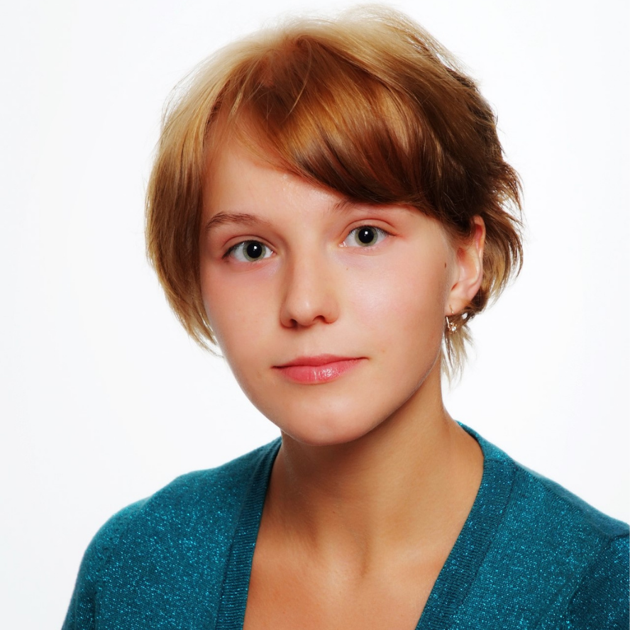

 

 

## About

<!--  -->

I'm a researcher and data scientist working in natural language processing, computational social science, and cultural analytics. I'm interested in modeling how people communicate about their personal experiences through text, especially when these communications occur in online communities centered on healthcare support or cultural objects like books or games. My research relies on unsupervised machine learning methods and re-explores the reliability and evaluation of these methods when applied to small, socially-specific datasets.

My past work has examined how postpartum people share and frame their [birth experiences](https://maria-antoniak.github.io/resources/2019_cscw_birth_stories.pdf), how online book reviewers use and write about [genres](https://maria-antoniak.github.io/resources/2021_cscw_librarything_genres.pdf), and how the use of word embedding models requires additional [stability tests](https://maria-antoniak.github.io/resources/2018_evaluating_stability.pdf) when used to measure biases.

I'm currently a PhD candidate in [Information Science](http://infosci.cornell.edu/) at Cornell University, where I'm advised by [David Mimno](https://mimno.infosci.cornell.edu/). I have a master's degree in [Computational Linguistics](https://www.compling.uw.edu/) from the University of Washington and have worked as a data scientist and research intern at places like [Microsoft Research](https://www.microsoft.com/en-us/research/), [Facebook Core Data Science](https://research.fb.com/core-data-science/), and [Pacific Northwest National Laboratory](https://www.pnl.gov/).

**I'll be on the job market starting in Fall 2023.** Please reach out if you think I'd be a good fit for your academic department or industry research group.

 

## News

<table style="width:100%">
  <tr>
    <td width="15%">Jun 2021</td>
    <td>Interning at <a href="https://cortex.twitter.com/">Twitter Cortex</a></td>
  </tr>
  <tr>
    <td width="15%">May 2021</td>
    <td>Our paper <a href="https://maria-antoniak.github.io/resources/2021_acl_bad_seeds.pdf">Bad Seeds: Evaluating Lexical Methods for Bias Measurement</a> is accepted at ACL 2021</td>
  </tr>
  <tr>
    <td width="15%">Dec 2020</td>
    <td>Paper on Goodreads classics published at <a href="https://post45.org/2021/04/the-goodreads-classics-a-computational-study-of-readers-amazon-and-crowdsourced-amateur-criticism/">Post45</a> & <a href="https://culturalanalytics.org/article/22221-the-goodreads-classics-a-computational-study-of-readers-amazon-and-crowdsourced-amateur-criticism">Cultural Analytics</a></td>
  </tr>
  <tr>
    <td width="15%">Feb 2021</td>
    <td>Speaking at Microsoft's <a href="https://www.microsoft.com/en-us/research/event/aiandgaming2021/">AI & Gaming Research Summit</a> on self disclosure in online gaming communities</td>
  </tr>
  <tr>
    <td width="15%">Dec 2020</td>
    <td>Paper on <a href="https://maria-antoniak.github.io/resources/2021_cscw_librarything_genres.pdf">genre and LibraryThing book reviews</a> published at CSCW</td>
  </tr>
</table>

 

## Other Things

* I'm the current President of [Grads for Gender Inclusion in Computing](https://gsgic.org/) at Cornell.
* I'm the current Webmaster (and former Social Chair and Treasurer) of [Graduate Women in Science](https://gwiscornell.wordpress.com/) at Cornell.
* In undergrad, I studied in the [Program of Liberal Studies](https://pls.nd.edu/), a reading-oriented set of tutorials and seminars, at the University of Notre Dame. I'm always happy to talk to students who are interested in transitioning from the humanities to technology.
* No relation (as far as I know) to [the other Antoniak](https://www.semanticscholar.org/author/C.-Antoniak/16645877) interested in the Dirichlet distribution.
* [books books books](https://maria-antoniak.github.io/reading)

   
